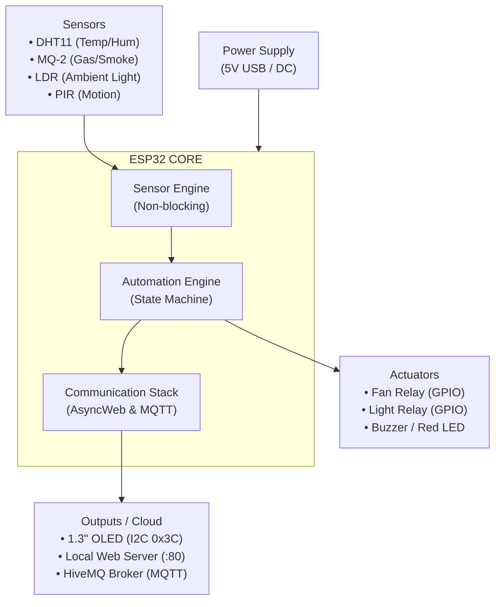

# Project 10: Full IoT Home Automation Hub

An advanced, asynchronous, edge-managed smart home automation hub powered by the **ESP32**. The system provides real-time multi-sensor telemetry, non-blocking local automation rules, safety trip protocols, a local web dashboard via **ESP32Async**, and live cloud telemetry streaming via **MQTT**.

---

## 🛠️ System Architecture



---

## 📋 Automation Rules & Threshold Matrix

The hub operates on a **non-blocking state machine** utilizing `millis()` to evaluate multi-sensor fusion logic without delaying system execution.

| Rule ID | Priority | Trigger Condition | System Action / Response | Hysteresis / Safety |
|---|---|---|---|---|
| **RULE 1** | High (Climate) | Temperature > 30.0°C | Fan Relay → **ON** | Turns OFF when Temp < 28.0°C (2.0°C hysteresis to prevent relay chatter) |
| **RULE 2** | Medium (Light) | Light Level < 40% **AND** Motion (PIR) == HIGH | Light Relay → **ON** | Stays ON for 30 seconds after motion ceases |
| **RULE 3** | **CRITICAL** (Gas Alert) | Gas Level > 15% | 1. Emergency Gas Trip Activated<br>2. Red LED + Buzzer Pulse<br>3. Safety Relay Shutdown | System remains in Alert mode until gas levels drop below threshold baseline |

---

## ⚙️ Manual Override Logic

To ensure user control and flexibility, the system supports both **Automatic Mode** and **Manual Override Mode**, accessible via the local Async Web Dashboard and MQTT control topics.

### State Independence
- When a relay is set to `AUTO`, the background state machine evaluates sensor inputs and toggles relays based on Rule 1, Rule 2, and Rule 3.
- When a manual toggle command is issued (e.g., `FAN_ON`, `FAN_OFF`, `LIGHT_ON`, `LIGHT_OFF`), the system shifts that specific device into **MANUAL** mode, ignoring sensor inputs for that load.

### Safety Emergency Priority
- **Rule 3 (Gas Emergency) overrules all manual settings.**
- If a gas leakage is detected (Gas Level > 15%), manual overrides are temporarily locked out, and all relays are safely de-energized/tripped until the gas clears.

### Resetting Overrides
- Sending an `AUTO` command via the dashboard or MQTT returns device control back to the dynamic sensor fusion logic.

---

## 🛰️ Telemetry & MQTT Data Format

Telemetry is published every **2–5 seconds** in JSON format to the topic:

```
iitjammu/student/home
```

```json
{
  "temp": 30.7,
  "humidity": 55.0,
  "gas": 5,
  "pir": 1,
  "light": 68,
  "fan": "AUTO_OFF",
  "light_relay": "AUTO_OFF",
  "alert": "OK"
}
```

---

## 🚀 Getting Started

### 1. Hardware Connections

| Sensor / Module | ESP32 Pin |
|---|---|
| DHT11 (Temp/Hum) | GPIO 4 (or GPIO 16) |
| MQ-2 (Gas/Smoke) | GPIO 35 |
| LDR (Ambient Light) | GPIO 34 |
| PIR (Motion) | GPIO 13 |
| I2C OLED — SDA | GPIO 21 |
| I2C OLED — SCL | GPIO 22 |

### 2. Configuration

Update your Wi-Fi credentials in `config.h`:

```cpp
#define WIFI_SSID "your-ssid"
#define WIFI_PASS "your-password"
```

### 3. Libraries Required

- **ESP32Async** (`AsyncTCP` & `ESPAsyncWebServer`)
- **PubSubClient** by Nick O'Leary
- **Adafruit SSD1306** & **Adafruit GFX**
- **DHT sensor library** by Adafruit
